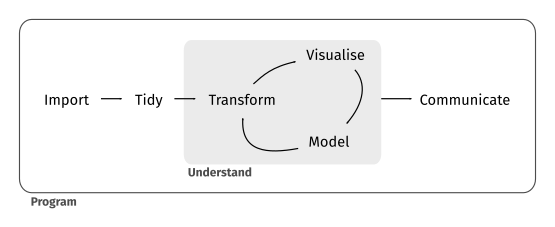

# Data processing

## Tidy Data

We followed Tidy Data principles exposed in [@tidydata2014] and  [@r4ds2016]. Those principles are closely tied to those of relational databases and Codd’s relational algebra.

<div class="figure">

<p class="caption">(\#fig:unnamed-chunk-1)Data pipeline</p>
</div>

## Filling gaps in our data

We use mirrored flows to cover gaps in raw data. Some countries report zero exports for some products, but we can inspect what their trade partners reported. If country A reported zero exports (imports) of product B to (from) country C, then we searched what country C reported of imports (exports) of product B from (to) country A.

Exports are reported FOB (free on board) while imports are reported CIF (cost, insurance and freight). When country A sends products to country C that will be registered with a larger value when it arrives to destination because the importer is including cost, insurance and freight that was not registered before shipping. There are different approaches to solve this difficulty, and in particular [@tradecosts2004], [@geography2009] and [@baci2010] discuss this in detail and propose that an 8% CIF/FOB ratio is suitable to discount costs and compare imports and exports.

There are some noble and remarkable approaches such as gravitational models. As, to our knowledge at the moment, there is no literature reporting the estimation of a gravity equation for this purpose that returns a satisfactory fitting.

Let $x_{c,c',p}$ represent the exports of country $c$ to country $c'$ in product $p$ and $m_{c',c,p}$ the imports of country $c'$ from country $c$. Under this notation we defined corrected flows as:

$$\hat{x}_{c,c',p} = \max\left\{x_{c,c',p}, \frac{m_{c',c,p}}{1.08}\right\}$$
$$\hat{m}_{c,c',p} = \max\left\{x_{c',c,p}, \frac{m_{c,c',p}}{1.08}\right\}$$
After symmetrization all observations are rounded to zero decimals.

## Data cleaning

You can check the GitHub repository, but here we provide a simplified and commented example that reproduces the exact steps we performed to clean the data.

Provided that Comtrade raw data cannot be redistributed, I'll limit the example to five reporters in the year 1962 (the first year with available data).
    
Let's define two files for the example:


```r
raw_file <- "raw_data_1962_five_reporters.rda"
clean_file <- "clean_data_1962_five_reporters.rda"
```

### Required packages


```r
library(data.table)
library(dplyr)
library(stringr)
library(purrr)
library(janitor)
```

### Custom function to read data


```r
fread2 <- function(file, select = NULL, character = NULL, numeric = NULL) {
  if(str_sub(file, start = -2) == "gz") {
    d <- fread(
      cmd = paste("zcat", file),
      select = select,
      colClasses = list(
        character = character,
        numeric = numeric
      )
    ) %>%
      as_tibble() %>%
      clean_names()
  } else {
    d <- fread(
      input = file,
      select = select,
      colClasses = list(
        character = character,
        numeric = numeric
      )
    ) %>%
      as_tibble() %>%
      clean_names()
  }
  
  return(d)
}
```

### CIF-FOB rate, commodity codes length and ISO codes


```r
# CIF-FOB rate ------------------------------------------------------------
    
# See Anderson & van Wincoop, 2004, Hummels, 2006 and Gaulier & Zignago, 2010 about 8% rate consistency
cif_fob_rate <- 1.08

# Commodity codes length --------------------------------------------------

J <- 4

# ISO-3 codes -------------------------------------------------------------
    
load("../comtrade-codes/01-2-tidy-country-data/country-codes.RData")
    
country_codes <- country_codes %>% 
  select(iso3_digit_alpha) %>% 
  mutate(iso3_digit_alpha = str_to_lower(iso3_digit_alpha)) %>% 
  filter(!iso3_digit_alpha %in% c("wld","null")) %>% 
  as_vector()
```

### Read raw data


```r
if (!file.exists(raw_file)) {
  raw_data <- fread2(
    "../yearly-datasets/01-raw-data/sitc-rev1/gz/type-C_r-ALL_ps-1962_freq-A_px-S1_pub-20050214_fmt-csv_ex-20151113.csv.gz",
    select = c("Year", "Aggregate Level", "Trade Flow", "Reporter ISO", "Partner ISO", "Commodity Code", "Trade Value (US$)"),
    character = "Commodity Code",
    numeric = "Trade Value (US$)"
  ) %>% 
    filter(
      reporter_iso == "CHL",
      partner_iso %in% c("ARG", "BRA", "PER")
    )
  
  save(raw_data, file = raw_file, compress = "xz")
  
  raw_data
} else {
  load(raw_file)
  
  raw_data
}
```

```
## # A tibble: 1,288 x 7
##     year aggregate_level trade_flow reporter_iso partner_iso commodity_code
##    <int>           <int> <chr>      <chr>        <chr>       <chr>         
##  1  1962               3 Import     CHL          BRA         071           
##  2  1962               3 Import     CHL          PER         071           
##  3  1962               4 Export     CHL          PER         2218          
##  4  1962               3 Export     CHL          ARG         265           
##  5  1962               3 Import     CHL          BRA         265           
##  6  1962               3 Import     CHL          PER         265           
##  7  1962               5 Export     CHL          BRA         29193         
##  8  1962               1 Export     CHL          ARG         3             
##  9  1962               1 Import     CHL          BRA         3             
## 10  1962               1 Import     CHL          PER         3             
## # … with 1,278 more rows, and 1 more variable: trade_value_us <dbl>
```

### Clean data


```r
if (!file.exists(clean_file)) {
  clean_data <- raw_data %>%
    
    rename(
      trade_value_usd = trade_value_us,
      product_code = commodity_code
    ) %>%
    
    filter(aggregate_level %in% J) %>%
    filter(trade_flow %in% c("Export","Import")) %>%
    
    filter(
      !is.na(product_code),
      product_code != "",
      product_code != " "
    ) %>%
    
    mutate(
      reporter_iso = str_to_lower(reporter_iso),
      partner_iso = str_to_lower(partner_iso)
    ) %>%
    
    filter(
      reporter_iso %in% country_codes,
      partner_iso %in% country_codes
    )
  
  save(clean_data, file = clean_file, compress = "xz")
  
  clean_data
} else {
  load(clean_file)
  
  clean_data
}
```

```
## # A tibble: 468 x 7
##     year aggregate_level trade_flow reporter_iso partner_iso product_code
##    <int>           <int> <chr>      <chr>        <chr>       <chr>       
##  1  1962               4 Export     chl          per         2218        
##  2  1962               4 Import     chl          arg         5417        
##  3  1962               4 Export     chl          per         6822        
##  4  1962               4 Import     chl          arg         7141        
##  5  1962               4 Import     chl          bra         7141        
##  6  1962               4 Import     chl          arg         7173        
##  7  1962               4 Import     chl          arg         0452        
##  8  1962               4 Import     chl          arg         0811        
##  9  1962               4 Import     chl          arg         2119        
## 10  1962               4 Import     chl          per         2119        
## # … with 458 more rows, and 1 more variable: trade_value_usd <dbl>
```

### Symmetric (clean) data


```r
# Exports data ------------------------------------------------------------

exports <- clean_data %>%
  filter(trade_flow == "Export") %>%
  select(reporter_iso, partner_iso, product_code, trade_value_usd) %>% 
  mutate(trade_value_usd = ceiling(trade_value_usd))

exports_mirrored <- clean_data %>%
  filter(trade_flow == "Import") %>%
  select(reporter_iso, partner_iso, product_code, trade_value_usd) %>% 
  mutate(trade_value_usd = ceiling(trade_value_usd / cif_fob_rate))

# Reporter and Partner must be inverted
colnames(exports_mirrored) <- c("partner_iso", "reporter_iso", "product_code", "trade_value_usd")

exports_conciliated <- exports %>%
      full_join(exports_mirrored, by = c("reporter_iso", "partner_iso", "product_code")) %>%
      rowwise() %>%
      mutate(trade_value_usd = max(trade_value_usd.x, trade_value_usd.y, na.rm = T)) %>%
      ungroup() %>%
      select(reporter_iso, partner_iso, product_code, trade_value_usd)

exports_conciliated
```

```
## # A tibble: 468 x 4
##    reporter_iso partner_iso product_code trade_value_usd
##    <chr>        <chr>       <chr>                  <dbl>
##  1 chl          per         2218                    1575
##  2 chl          per         6822                  154203
##  3 chl          arg         2762                    5575
##  4 chl          arg         2813                 1955476
##  5 chl          arg         6821                 2614875
##  6 chl          bra         6821                14049626
##  7 chl          per         8960                     675
##  8 chl          arg         9310                   74875
##  9 chl          bra         9310                   35175
## 10 chl          per         9310                   27276
## # … with 458 more rows
```

## GitHub repositories

* [Getting and cleaning data from UN COMTRADE (OTS Yearly Data)](https://github.com/tradestatistics/yearly-datasets)
* [Scraping data from The Atlas of Economic Complexity (OTS Atlas Data)](https://github.com/tradestatistics/atlas-data)
* [Product and country codes (OTS Comtrade Codes)](https://github.com/tradestatistics/comtrade-codes)
* [R packages library for reproducibility (OTS Packrat Library)](https://github.com/tradestatistics/packrat-library/)

## Software information

We used R 3.4.3 and RStudio Desktop 1.1 on Ubuntu Desktop 18.04.

We built R from binaries in order to obtain a setup linked with multi-threaded numeric libraries. Our build is linked to OpenBLAS which we used over alternatives such as Intel MKL, BLAS or ATLAS that can also be used.

## Hardware information

All the data processing was done by using a DigitalOcean droplet with 6 vCPUs and 32GB in RAM to accelerate data processing.

The functions were executed using parallelization on four cores. Please notice that running our scripts with parallelization demands more RAM than the amount you can find on an average laptop. You can always disable parallelization in the scripts or reduce the default number of cores.

## Reproducibility notes

To guarantee reproducibility we provide [Packrat](https://rstudio.github.io/packrat/) snapshot and bundles. This prevents changes in syntax, functions or dependencies.

Our R installation is isolated from apt-get to avoid any accidental updates that can alter the data pipeline and/or the output.

The projects are related to each other. In order to avoid multiple copies of files some projects read files from other projects. For example, [OTS Yearly Datasets](https://github.com/tradestatistics/yearly-datasets) uses [OTS Atlas Data](https://github.com/tradestatistics/atlas-data) as inpu.

The only reproducibility flaw of this project lies in data downloading. Obtaining raw datasets from UN COMTRADE demands an API key that can only be obtained with institutional access that is limited to some universities and institutes.

## Coding style and performant code

We used the [Tidyverse Style Guide](http://style.tidyverse.org/). As cornerstone references for performant code we followed [@advancedr2014] and [@masteringsoftware2017].

## Note for Windows users

If you use Windows the scripts will only use a single core because we used a parallelization that depends on fork system call that is only supported on Unix systems. You can always run the scripts on Windows and the only difference will be that it will use less RAM and processor, and it will be slower to compute.

Also, before running the scripts on Windows verify that you installed GNU Utilities beforehand. One easy option is to install [Chocolatey](https://chocolatey.org/) first and then install the GNU Utilities by running `choco install unxutils` on Cmd or Power Shell as administrator.
