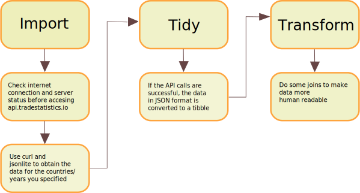

# Accesing the data

## Before downloading datasets

If you are going to download data, you have to read the [Code of Conduct](https://docs.tradestatistics.io/index.html#code-of-conduct) first.

## API

The advantage of the API over https download is that you can filter what to obtain and also access some additional tables.

To obtain exactly the same data as with compressed files, please refer to \@ref(yrpc-year-reporter-partner-and-product-code).

If you use R you'll need `jsonlite` and `dplyr` packages.


```r
library(jsonlite)
```

These packages are also useful:


```r
library(dplyr)
library(stringr)
```

### Available tables


```r
as_tibble(fromJSON("https://api.tradestatistics.io/tables"))
```

```
## # A tibble: 12 x 3
##    table      description                        source                    
##    <chr>      <chr>                              <chr>                     
##  1 countries  Countries metadata                 UN Comtrade               
##  2 products   Product metadata                   UN Comtrade               
##  3 reporters  Reporting countries                UN Comtrade               
##  4 communiti… Product communities                Center for International …
##  5 product_s… Product short names                The Observatory of Econom…
##  6 country_r… Ranking of countries               Open Trade Statistics     
##  7 product_r… Ranking of products                Open Trade Statistics     
##  8 yrpc       Bilateral trade at product level … Open Trade Statistics     
##  9 yrp        Reporter trade at aggregated leve… Open Trade Statistics     
## 10 yrc        Reporter trade at aggregated leve… Open Trade Statistics     
## 11 yr         Reporter trade at aggregated leve… Open Trade Statistics     
## 12 yc         Product trade at aggregated level… Open Trade Statistics
```

### Metadata


```r
## Countries (no filter)
rda_countries <- "countries.rda"

if (!file.exists(rda_countries)) {
  countries <- as_tibble(fromJSON(
    "https://api.tradestatistics.io/countries"
  ))

  save(countries, file = rda_countries, compress = "xz")

  countries
} else {
  load(rda_countries)

  countries
}
```

```
## # A tibble: 249 x 6
##    country_iso country_name_en… country_fullnam… continent_id continent
##    <chr>       <chr>            <chr>                   <int> <chr>    
##  1 afg         Afghanistan      Afghanistan                 1 Asia     
##  2 alb         Albania          Albania                     2 Europe   
##  3 dza         Algeria          Algeria                     3 Africa   
##  4 asm         American Samoa   American Samoa              4 Oceania  
##  5 and         Andorra          Andorra                     2 Europe   
##  6 ago         Angola           Angola                      3 Africa   
##  7 aia         Anguilla         Anguilla                    5 Americas 
##  8 atg         Antigua and Bar… Antigua and Bar…            5 Americas 
##  9 arg         Argentina        Argentina                   5 Americas 
## 10 arm         Armenia          Armenia                     1 Asia     
## # … with 239 more rows, and 1 more variable: eu28_member <int>
```

```r
## Products (no filter)
rda_products <- "products.rda"

if (!file.exists(rda_products)) {
  products <- as_tibble(fromJSON(
    "https://api.tradestatistics.io/products"
  ))

  save(products, file = rda_products, compress = "xz")

  products
} else {
  load(rda_products)

  products
}
```

```
## # A tibble: 1,320 x 4
##    product_code product_fullname_english          group_code group_name    
##    <chr>        <chr>                             <chr>      <chr>         
##  1 0101         Horses, asses, mules and hinnies… 01         Animals; live 
##  2 0102         Bovine animals; live              01         Animals; live 
##  3 0103         Swine; live                       01         Animals; live 
##  4 0104         Sheep and goats; live             01         Animals; live 
##  5 0105         Poultry; live, fowls of the spec… 01         Animals; live 
##  6 0106         Animals, n.e.c. in chapter 01; l… 01         Animals; live 
##  7 0201         Meat of bovine animals; fresh or… 02         Meat and edib…
##  8 0202         Meat of bovine animals; frozen    02         Meat and edib…
##  9 0203         Meat of swine; fresh, chilled or… 02         Meat and edib…
## 10 0204         Meat of sheep or goats; fresh, c… 02         Meat and edib…
## # … with 1,310 more rows
```

Please notice that these tables include some aliases. 

`countries` includes some meta-codes, `c-xx` where `xx` must the first two letters of a continent and `all`, this is:


Alias   Meaning                                       
------  ----------------------------------------------
c-af    Alias for all valid ISO codes in Africa       
c-am    Alias for all valid ISO codes in the Americas 
c-as    Alias for all valid ISO codes in Asia         
c-eu    Alias for all valid ISO codes in Europe       
c-oc    Alias for all valid ISO codes in Oceania      
all     Alias for all valid ISO codes in the World    

`products` also includes some meta-codes, `xx` for the first two digits of a code and those digits are the product group and `all`, this is:


Alias   Meaning                                                                                                                                                                                                                                                                    
------  ---------------------------------------------------------------------------------------------------------------------------------------------------------------------------------------------------------------------------------------------------------------------------
01      Alias for all codes in the group Animals; live                                                                                                                                                                                                                             
02      Alias for all codes in the group Meat and edible meat offal                                                                                                                                                                                                                
03      Alias for all codes in the group Fish and crustaceans, molluscs and other aquatic invertebrates                                                                                                                                                                            
04      Alias for all codes in the group Dairy produce; birds' eggs; natural honey; edible products of animal origin, not elsewhere specified or included                                                                                                                          
05      Alias for all codes in the group Animal originated products; not elsewhere specified or included                                                                                                                                                                           
06      Alias for all codes in the group Trees and other plants, live; bulbs, roots and the like; cut flowers and ornamental foliage                                                                                                                                               
07      Alias for all codes in the group Vegetables and certain roots and tubers; edible                                                                                                                                                                                           
08      Alias for all codes in the group Fruit and nuts, edible; peel of citrus fruit or melons                                                                                                                                                                                    
09      Alias for all codes in the group Coffee, tea, mate and spices                                                                                                                                                                                                              
10      Alias for all codes in the group Cereals                                                                                                                                                                                                                                   
11      Alias for all codes in the group Products of the milling industry; malt, starches, inulin, wheat gluten                                                                                                                                                                    
12      Alias for all codes in the group Oil seeds and oleaginous fruits; miscellaneous grains, seeds and fruit, industrial or medicinal plants; straw and fodder                                                                                                                  
13      Alias for all codes in the group Lac; gums, resins and other vegetable saps and extracts                                                                                                                                                                                   
14      Alias for all codes in the group Vegetable plaiting materials; vegetable products not elsewhere specified or included                                                                                                                                                      
15      Alias for all codes in the group Animal or vegetable fats and oils and their cleavage products; prepared animal fats; animal or vegetable waxes                                                                                                                            
16      Alias for all codes in the group Meat, fish or crustaceans, molluscs or other aquatic invertebrates; preparations thereof                                                                                                                                                  
17      Alias for all codes in the group Sugars and sugar confectionery                                                                                                                                                                                                            
18      Alias for all codes in the group Cocoa and cocoa preparations                                                                                                                                                                                                              
19      Alias for all codes in the group Preparations of cereals, flour, starch or milk; pastrycooks' products                                                                                                                                                                     
20      Alias for all codes in the group Preparations of vegetables, fruit, nuts or other parts of plants                                                                                                                                                                          
21      Alias for all codes in the group Miscellaneous edible preparations                                                                                                                                                                                                         
22      Alias for all codes in the group Beverages, spirits and vinegar                                                                                                                                                                                                            
23      Alias for all codes in the group Food industries, residues and wastes thereof; prepared animal fodder                                                                                                                                                                      
24      Alias for all codes in the group Tobacco and manufactured tobacco substitutes                                                                                                                                                                                              
25      Alias for all codes in the group Salt; sulphur; earths, stone; plastering materials, lime and cement                                                                                                                                                                       
26      Alias for all codes in the group Ores, slag and ash                                                                                                                                                                                                                        
27      Alias for all codes in the group Mineral fuels, mineral oils and products of their distillation; bituminous substances; mineral waxes                                                                                                                                      
28      Alias for all codes in the group Inorganic chemicals; organic and inorganic compounds of precious metals; of rare earth metals, of radio-active elements and of isotopes                                                                                                   
29      Alias for all codes in the group Organic chemicals                                                                                                                                                                                                                         
30      Alias for all codes in the group Pharmaceutical products                                                                                                                                                                                                                   
31      Alias for all codes in the group Fertilizers                                                                                                                                                                                                                               
32      Alias for all codes in the group Tanning or dyeing extracts; tannins and their derivatives; dyes, pigments and other colouring matter; paints, varnishes; putty, other mastics; inks                                                                                       
33      Alias for all codes in the group Essential oils and resinoids; perfumery, cosmetic or toilet preparations                                                                                                                                                                  
34      Alias for all codes in the group Soap, organic surface-active agents; washing, lubricating, polishing or scouring preparations; artificial or prepared waxes, candles and similar articles, modelling pastes, dental waxes and dental preparations with a basis of plaster 
35      Alias for all codes in the group Albuminoidal substances; modified starches; glues; enzymes                                                                                                                                                                                
36      Alias for all codes in the group Explosives; pyrotechnic products; matches; pyrophoric alloys; certain combustible preparations                                                                                                                                            
37      Alias for all codes in the group Photographic or cinematographic goods                                                                                                                                                                                                     
38      Alias for all codes in the group Chemical products n.e.c.                                                                                                                                                                                                                  
39      Alias for all codes in the group Plastics and articles thereof                                                                                                                                                                                                             
40      Alias for all codes in the group Rubber and articles thereof                                                                                                                                                                                                               
41      Alias for all codes in the group Raw hides and skins (other than furskins) and leather                                                                                                                                                                                     
42      Alias for all codes in the group Articles of leather; saddlery and harness; travel goods, handbags and similar containers; articles of animal gut (other than silk-worm gut)                                                                                               
43      Alias for all codes in the group Furskins and artificial fur; manufactures thereof                                                                                                                                                                                         
44      Alias for all codes in the group Wood and articles of wood; wood charcoal                                                                                                                                                                                                  
45      Alias for all codes in the group Cork and articles of cork                                                                                                                                                                                                                 
46      Alias for all codes in the group Manufactures of straw, esparto or other plaiting materials; basketware and wickerwork                                                                                                                                                     
47      Alias for all codes in the group Pulp of wood or other fibrous cellulosic material; recovered (waste and scrap) paper or paperboard                                                                                                                                        
48      Alias for all codes in the group Paper and paperboard; articles of paper pulp, of paper or paperboard                                                                                                                                                                      
49      Alias for all codes in the group Printed books, newspapers, pictures and other products of the printing industry; manuscripts, typescripts and plans                                                                                                                       
50      Alias for all codes in the group Silk                                                                                                                                                                                                                                      
51      Alias for all codes in the group Wool, fine or coarse animal hair; horsehair yarn and woven fabric                                                                                                                                                                         
52      Alias for all codes in the group Cotton                                                                                                                                                                                                                                    
53      Alias for all codes in the group Vegetable textile fibres; paper yarn and woven fabrics of paper yarn                                                                                                                                                                      
54      Alias for all codes in the group Man-made filaments; strip and the like of man-made textile materials                                                                                                                                                                      
55      Alias for all codes in the group Man-made staple fibres                                                                                                                                                                                                                    
56      Alias for all codes in the group Wadding, felt and nonwovens, special yarns; twine, cordage, ropes and cables and articles thereof                                                                                                                                         
57      Alias for all codes in the group Carpets and other textile floor coverings                                                                                                                                                                                                 
58      Alias for all codes in the group Fabrics; special woven fabrics, tufted textile fabrics, lace, tapestries, trimmings, embroidery                                                                                                                                           
59      Alias for all codes in the group Textile fabrics; impregnated, coated, covered or laminated; textile articles of a kind suitable for industrial use                                                                                                                        
60      Alias for all codes in the group Fabrics; knitted or crocheted                                                                                                                                                                                                             
61      Alias for all codes in the group Apparel and clothing accessories; knitted or crocheted                                                                                                                                                                                    
62      Alias for all codes in the group Apparel and clothing accessories; not knitted or crocheted                                                                                                                                                                                
63      Alias for all codes in the group Textiles, made up articles; sets; worn clothing and worn textile articles; rags                                                                                                                                                           
64      Alias for all codes in the group Footwear; gaiters and the like; parts of such articles                                                                                                                                                                                    
65      Alias for all codes in the group Headgear and parts thereof                                                                                                                                                                                                                
66      Alias for all codes in the group Umbrellas, sun umbrellas, walking-sticks, seat sticks, whips, riding crops; and parts thereof                                                                                                                                             
67      Alias for all codes in the group Feathers and down, prepared; and articles made of feather or of down; artificial flowers; articles of human hair                                                                                                                          
68      Alias for all codes in the group Stone, plaster, cement, asbestos, mica or similar materials; articles thereof                                                                                                                                                             
69      Alias for all codes in the group Ceramic products                                                                                                                                                                                                                          
70      Alias for all codes in the group Glass and glassware                                                                                                                                                                                                                       
71      Alias for all codes in the group Natural, cultured pearls; precious, semi-precious stones; precious metals, metals clad with precious metal, and articles thereof; imitation jewellery; coin                                                                               
72      Alias for all codes in the group Iron and steel                                                                                                                                                                                                                            
73      Alias for all codes in the group Iron or steel articles                                                                                                                                                                                                                    
74      Alias for all codes in the group Copper and articles thereof                                                                                                                                                                                                               
75      Alias for all codes in the group Nickel and articles thereof                                                                                                                                                                                                               
76      Alias for all codes in the group Aluminium and articles thereof                                                                                                                                                                                                            
78      Alias for all codes in the group Lead and articles thereof                                                                                                                                                                                                                 
79      Alias for all codes in the group Zinc and articles thereof                                                                                                                                                                                                                 
80      Alias for all codes in the group Tin; articles thereof                                                                                                                                                                                                                     
81      Alias for all codes in the group Metals; n.e.c., cermets and articles thereof                                                                                                                                                                                              
82      Alias for all codes in the group Tools, implements, cutlery, spoons and forks, of base metal; parts thereof, of base metal                                                                                                                                                 
83      Alias for all codes in the group Metal; miscellaneous products of base metal                                                                                                                                                                                               
84      Alias for all codes in the group Nuclear reactors, boilers, machinery and mechanical appliances; parts thereof                                                                                                                                                             
85      Alias for all codes in the group Electrical machinery and equipment and parts thereof; sound recorders and reproducers; television image and sound recorders and reproducers, parts and accessories of such articles                                                       
86      Alias for all codes in the group Railway, tramway locomotives, rolling-stock and parts thereof; railway or tramway track fixtures and fittings and parts thereof; mechanical (including electro-mechanical) traffic signalling equipment of all kinds                      
87      Alias for all codes in the group Vehicles; other than railway or tramway rolling stock, and parts and accessories thereof                                                                                                                                                  
88      Alias for all codes in the group Aircraft, spacecraft and parts thereof                                                                                                                                                                                                    
89      Alias for all codes in the group Ships, boats and floating structures                                                                                                                                                                                                      
90      Alias for all codes in the group Optical, photographic, cinematographic, measuring, checking, medical or surgical instruments and apparatus; parts and accessories                                                                                                         
91      Alias for all codes in the group Clocks and watches and parts thereof                                                                                                                                                                                                      
92      Alias for all codes in the group Musical instruments; parts and accessories of such articles                                                                                                                                                                               
93      Alias for all codes in the group Arms and ammunition; parts and accessories thereof                                                                                                                                                                                        
94      Alias for all codes in the group Furniture; bedding, mattresses, mattress supports, cushions and similar stuffed furnishings; lamps and lighting fittings, n.e.c.; illuminated signs, illuminated name-plates and the like; prefabricated buildings                        
95      Alias for all codes in the group Toys, games and sports requisites; parts and accessories thereof                                                                                                                                                                          
96      Alias for all codes in the group Miscellaneous manufactured articles                                                                                                                                                                                                       
97      Alias for all codes in the group Works of art; collectors' pieces and antiques                                                                                                                                                                                             
99      Alias for all codes in the group Commodities not specified according to kind                                                                                                                                                                                               
all     Alias for all codes                                                                                                                                                                                                                                                        

### API parameters

The tables provided withing our API contain at least one of these fields:

* Year (`y`) 
* Reporter ISO (`r`)
* Partner ISO (`p`)
* Product Code (`c`)

The most detailed table is `yrpc` that contains all bilateral flows at product level.

With respect to `y` you can pass any integer contained in $[1962,2018]$.

Both `r` and `p` accept any valid ISO code or alias contained in the [countries](https://api.tradestatistics.io/countries) table. For example, both `chl` (valid ISO code) and `c-am` (continent Americas, an alias) are valid API filtering parameters.

`c` takes any valid product code or alias from the [products](https://api.tradestatistics.io/products). For example, both `0101` (valid HS product code) and `01` (valid HS group code) are valid API filtering parameters.

By default the API takes `c = "all"` by default.

You can always skip `c`, but `y`, `r` and `p` are requiered to return data.

### Available reporters

The only applicable filter is by year.


```r
# Available reporters (filter by year)
as_tibble(fromJSON(
  "https://api.tradestatistics.io/reporters?y=2018"
))
```

```
## # A tibble: 226 x 1
##    reporter_iso
##    <chr>       
##  1 zwe         
##  2 zmb         
##  3 zaf         
##  4 yem         
##  5 wsm         
##  6 wlf         
##  7 vut         
##  8 vnm         
##  9 vgb         
## 10 ven         
## # … with 216 more rows
```

### YRPC (Year, Reporter, Partner and Product Code)

The applicable filters here are year, reporter, partner and product code.


```r
# Year - Reporter - Partner - Product Code

yrpc_1 <- as_tibble(fromJSON(
  "https://api.tradestatistics.io/yrpc?y=1962&r=usa&p=mex&c=8703"
))

yrpc_1
```

```
## # A tibble: 1 x 6
##    year reporter_iso partner_iso product_code export_value_usd
##   <int> <chr>        <chr>       <chr>                   <int>
## 1  1962 usa          mex         8703                 72334238
## # … with 1 more variable: import_value_usd <int>
```

Columns definition:

* `reporter_iso`: Official ISO-3 code for the reporter (e.g. the country that reports X dollars in exports/imports from/to country Y)
* `partner_iso`: Official ISO-3 code for the partner
* `product_code`: Official Harmonized System rev. 2007 (HS07) product code (e.g. according to the \code{products} table in the API, 8703 stands for "Motor cars and other motor vehicles; principally designed for the transport of persons (other than those of heading no. 8702), including station wagons and racing cars")
* `export_value_usd`: Exports measured in nominal United States Dollars (USD)
* `import_value_usd`: Imports measured in nominal United States Dollars (USD)

### YRPC-GA (Year - Reporter - Partner - Product Code, Group Code Aggregated)

The applicable filters here are year, reporter, partner and group code. Here the group code is just an aggregation over product code.


```r
# Year - Reporter - Partner - Product Code, Group Code Aggregated

yrpc_ga <- as_tibble(fromJSON(
  "https://api.tradestatistics.io/yrpc-ga?y=1962&r=usa&p=mex&g=87"
))

yrpc_ga
```

```
## # A tibble: 1 x 6
##    year reporter_iso partner_iso group_code export_value_usd
##   <int> <chr>        <chr>       <chr>                 <int>
## 1  1962 usa          mex         87                136983479
## # … with 1 more variable: import_value_usd <int>
```

Columns definition:

* `group_code`: Official Harmonized System rev. 2007 (HS07) group code (e.g. according to the \code{products} table in the API, 87 stands for "Vehicles; other than railway or tramway rolling stock, and parts and accessories thereof")

### YRPC-CA (Year - Reporter - Partner - Product Code, Community Code Aggregated)

The applicable filters here are year, reporter, partner and community code. Here the community code is just an aggregation over both product code and group code.


```r
# Year - Reporter - Partner - Product Code, Community Code Aggregated

yrpc_ca <- as_tibble(fromJSON(
  "https://api.tradestatistics.io/yrpc-ca?y=1962&r=usa&p=mex&o=17"
))

yrpc_ca
```

```
## # A tibble: 1 x 6
##    year reporter_iso partner_iso community_code export_value_usd
##   <int> <chr>        <chr>       <chr>                     <int>
## 1  1962 usa          mex         17                    196732494
## # … with 1 more variable: import_value_usd <int>
```

Columns definition:

* `community_code`: Unofficial Harvard CID community code (e.g. according to the \code{communities} table in the API, 17 stands for "Transportation")

### YRPC-GCA (Year - Reporter - Partner - Product Code, Group Code and Community Code Aggregated)

The applicable filters here are year, reporter, partner and community code. Here the community code is just an aggregation over both product code and group code.


```r
# Year - Reporter - Partner - Product Code, Community Code Aggregated

yrpc_gca <- as_tibble(fromJSON(
  "https://api.tradestatistics.io/yrpc-gca?y=1962&r=usa&p=mex&o=17"
))

yrpc_gca
```

```
## # A tibble: 4 x 7
##    year reporter_iso partner_iso group_code community_code export_value_usd
##   <int> <chr>        <chr>       <chr>      <chr>                     <int>
## 1  1962 usa          mex         86         17                     26210502
## 2  1962 usa          mex         87         17                    136983479
## 3  1962 usa          mex         88         17                     28529998
## 4  1962 usa          mex         89         17                      5008515
## # … with 1 more variable: import_value_usd <int>
```

### YRC (Year, Reporter and Product Code)

The only applicable filter is by year, reporter, product code and (optionally) product code length.


```r
# Year - Reporter - Product Code

yrc <- as_tibble(fromJSON(
  "https://api.tradestatistics.io/yrc?y=1962&r=chl"
))

yrc
```

```
## # A tibble: 912 x 7
##     year reporter_iso product_code export_value_usd import_value_usd
##    <int> <chr>        <chr>                   <int>            <int>
##  1  1962 chl          0101                   289076            50833
##  2  1962 chl          0102                    17685         22167651
##  3  1962 chl          0103                        0            32399
##  4  1962 chl          0104                    12870           199519
##  5  1962 chl          0105                        0           132064
##  6  1962 chl          0106                    20259            10548
##  7  1962 chl          0201                    13075          3520194
##  8  1962 chl          0203                        0           275764
##  9  1962 chl          0204                   387625            78528
## 10  1962 chl          0206                    38106                0
## # … with 902 more rows, and 2 more variables: export_rca <dbl>,
## #   import_rca <dbl>
```

Columns definition:

* `export_rca`:  Balassa Index or [Revealed Comparative Advantage](https://docs.tradestatistics.io/the-mathematics-of-economic-complexity.html#revealed-comparative-advantage-rca) of an exported product. 
* `import_rca`:  Balassa Index or [Revealed Comparative Advantage](https://docs.tradestatistics.io/the-mathematics-of-economic-complexity.html#revealed-comparative-advantage-rca) of and imported product. 

### YRP (Year, Reporter and Partner)

The only applicable filter is by year, reporter and partner.


```r
# Year - Reporter - Partner
yrp <- as_tibble(fromJSON(
  "https://api.tradestatistics.io/yrp?y=2018&r=chl&p=arg"
))

yrp
```

```
## # A tibble: 1 x 5
##    year reporter_iso partner_iso export_value_usd import_value_usd
##   <int> <chr>        <chr>                  <int>            <dbl>
## 1  2018 chl          arg                837640220       3768079208
```

### YC (Year and Product Code)

The only applicable filter is by year, product and (optionally) product code length.


```r
# Year - Product Code
yc <- as_tibble(fromJSON(
  "https://api.tradestatistics.io/yc?y=2018&c=0101"
))

yc
```

```
## # A tibble: 1 x 14
##    year product_code export_value_usd import_value_usd pci_fitness_met…
##   <int> <chr>                   <dbl>            <dbl>            <dbl>
## 1  2018 0101               4073362162       4073362162            0.293
## # … with 9 more variables: pci_rank_fitness_method <int>,
## #   pci_reflections_method <dbl>, pci_rank_reflections_method <int>,
## #   pci_eigenvalues_method <dbl>, pci_rank_eigenvalues_method <int>,
## #   top_exporter_iso <chr>, top_exporter_trade_value_usd <int>,
## #   top_importer_iso <chr>, top_importer_trade_value_usd <int>
```

Columns definition:

* `pci_fitness_method`: Product Complexity Index (PCI) computed by using the [Fitness Method](https://docs.tradestatistics.io/the-mathematics-of-economic-complexity.html#fitness-method).
* `pci_reflections_method`: Product Complexity Index (PCI) computed by using the [Reflections Method](https://docs.tradestatistics.io/the-mathematics-of-economic-complexity.html#reflections-method).
* `pci_eigenvalues_method`: Product Complexity Index (PCI) computed by using the [Eigenvalues Method](https://docs.tradestatistics.io/the-mathematics-of-economic-complexity.html#eigenvalues-method).
* `pci_rank_*_method`: The rank of a product given its PCI (e.g. the highest PCI obtains the #1)

### YR (Year and Reporter)

The only applicable filter is by year and reporter.


```r
## Year - Reporter
yr <- as_tibble(fromJSON(
  "https://api.tradestatistics.io/yr?y=2018&r=chl"
))

yr
```

```
## # A tibble: 1 x 14
##    year reporter_iso export_value_usd import_value_usd cci_fitness_met…
##   <int> <chr>                   <dbl>            <dbl>            <dbl>
## 1  2018 chl               82917211883      83743442685            0.420
## # … with 9 more variables: cci_rank_fitness_method <int>,
## #   cci_reflections_method <dbl>, cci_rank_reflections_method <int>,
## #   cci_eigenvalues_method <dbl>, cci_rank_eigenvalues_method <int>,
## #   top_export_product_code <chr>, top_export_trade_value_usd <dbl>,
## #   top_import_product_code <chr>, top_import_trade_value_usd <dbl>
```

Columns definition:

* `cci_fitness_method`: Country Complexity Index (CCI) computed by using the [Fitness Method](https://docs.tradestatistics.io/the-mathematics-of-economic-complexity.html#fitness-method).
* `cci_reflections_method`: Country Complexity Index (CCI) computed by using the [Reflections Method](https://docs.tradestatistics.io/the-mathematics-of-economic-complexity.html#reflections-method).
* `cci_eigenvalues_method`: Country Complexity Index (CCI) computed by using the [Eigenvalues Method](https://docs.tradestatistics.io/the-mathematics-of-economic-complexity.html#eigenvalues-method).
* `cci_rank_*_method`: The rank of a product given its CCI (e.g. the highest CCI obtains the #1)

### Other group/community aggregated tables

As you might notice in [api.tradestatistics.io/tables](https://api.tradestatistics.io/tables), there are more tables:

* yrc-ga
* yrc-ca
* yrc-gca
* yr-short
* yr-ga
* yr-ca

These tables follow the same parameters as the examples above.

### Country rankings

The only applicable filter is by year.


```r
# Country rankings
country_rankings <- as_tibble(fromJSON(
  "https://api.tradestatistics.io/country_rankings?y=2018"
))
```

### Product rankings

The only applicable filter is by year.


```r
# Product rankings
product_rankings <- as_tibble(fromJSON(
  "https://api.tradestatistics.io/product_rankings?y=2018"
))
```

## R Package

To ease API using, we provide an [R Package](https://ropensci.github.io/tradestatistics/). This package is a part of [ROpenSci](https://ropensci.org/) and its documentation is available on a separate [pkgdown site](https://ropensci.github.io/tradestatistics/).

Here's what the package does:

<div class="figure">

<p class="caption">(\#fig:unnamed-chunk-10)R package flow</p>
</div>

## Dashboard (beta)

To ease API using, we provide a [Shiny Dashboard](https://shiny.tradestatistics.io/) that is still under improvements.

## RDS datasets

Please check the [md5sums](https://docs.tradestatistics.io/direct-download/md5sums.txt) to verify data integrity after downloading.


Year                                                                    Last updated    File size (MB)  MD5 sum                          
----------------------------------------------------------------------  -------------  ---------------  ---------------------------------
[1962](https://docs.tradestatistics.io/direct-download/yrpc-1962.rds)   2020-02-11                2.63  0710271b2ad39456b1eb535f5d5e9f56 
[1963](https://docs.tradestatistics.io/direct-download/yrpc-1963.rds)   2020-02-11                3.17  152bddc2916d86090da498f92945de74 
[1964](https://docs.tradestatistics.io/direct-download/yrpc-1964.rds)   2020-02-11                3.47  d528349e5505c7763d776b21a1f5f15a 
[1965](https://docs.tradestatistics.io/direct-download/yrpc-1965.rds)   2020-02-11                3.92  db6b5cad4c2c17b7d0b8e1cc6a68d028 
[1966](https://docs.tradestatistics.io/direct-download/yrpc-1966.rds)   2020-02-11                4.17  2dfcf4fa79e8fe3951d4502ca3e7ccf1 
[1967](https://docs.tradestatistics.io/direct-download/yrpc-1967.rds)   2020-02-11                4.33  289e46b050a6a552e8dc18ac9ba4d568 
[1968](https://docs.tradestatistics.io/direct-download/yrpc-1968.rds)   2020-02-11                4.51  55a02f559401d8d59438855d02fad980 
[1969](https://docs.tradestatistics.io/direct-download/yrpc-1969.rds)   2020-02-11                4.77  747810a983548041bf7b255f9c1aabed 
[1970](https://docs.tradestatistics.io/direct-download/yrpc-1970.rds)   2020-02-11                5.29  4e1b4f1d117c20202d514334ef4c4d91 
[1971](https://docs.tradestatistics.io/direct-download/yrpc-1971.rds)   2020-02-11                5.47  ae058dbef525921c1ffe6fca579f019a 
[1972](https://docs.tradestatistics.io/direct-download/yrpc-1972.rds)   2020-02-11                5.75  7d742e516e06a764c464b578a817b121 
[1973](https://docs.tradestatistics.io/direct-download/yrpc-1973.rds)   2020-02-11                6.21  a561dbf7598452dd79b996e6c19ed053 
[1974](https://docs.tradestatistics.io/direct-download/yrpc-1974.rds)   2020-02-11                6.69  6b139d5e9399cf98f776cdb81b713ad5 
[1975](https://docs.tradestatistics.io/direct-download/yrpc-1975.rds)   2020-02-11                6.80  487683a9f033afac988c9f00c966e410 
[1976](https://docs.tradestatistics.io/direct-download/yrpc-1976.rds)   2020-02-11                6.78  48b632a07a3d097400811b0d80ceb566 
[1977](https://docs.tradestatistics.io/direct-download/yrpc-1977.rds)   2020-02-11                7.16  1048fb22908b42c5dc3ebda762286e6a 
[1978](https://docs.tradestatistics.io/direct-download/yrpc-1978.rds)   2020-02-11                7.55  2dcac6cebcb28839c2c7317863746d29 
[1979](https://docs.tradestatistics.io/direct-download/yrpc-1979.rds)   2020-02-11                7.97  bc15d15ac627685e1eea7f4d53642f0d 
[1980](https://docs.tradestatistics.io/direct-download/yrpc-1980.rds)   2020-02-11                8.35  f7af0c5caa489f0f772459eebcf6f46f 
[1981](https://docs.tradestatistics.io/direct-download/yrpc-1981.rds)   2020-02-11                8.42  5a09b82d76cced2043db08bd6077dbf0 
[1982](https://docs.tradestatistics.io/direct-download/yrpc-1982.rds)   2020-02-11                8.32  ee43f099b2263e5048928ec9792dcb20 
[1983](https://docs.tradestatistics.io/direct-download/yrpc-1983.rds)   2020-02-11                8.39  1cc3c5839d91c9ae6186751c09b23e84 
[1984](https://docs.tradestatistics.io/direct-download/yrpc-1984.rds)   2020-02-11                8.37  56577fbc39804dcccf37546c8718fe7b 
[1985](https://docs.tradestatistics.io/direct-download/yrpc-1985.rds)   2020-02-11                8.61  ff48557e8caeef78ca5add4100dd9744 
[1986](https://docs.tradestatistics.io/direct-download/yrpc-1986.rds)   2020-02-11                8.99  74795130828662098ba6c4e002dad054 
[1987](https://docs.tradestatistics.io/direct-download/yrpc-1987.rds)   2020-02-11                9.29  5804b112b6eef00d5ba806a5d305f524 
[1988](https://docs.tradestatistics.io/direct-download/yrpc-1988.rds)   2020-02-11                9.70  115e004f3685c8656cd30905ab8dfefd 
[1989](https://docs.tradestatistics.io/direct-download/yrpc-1989.rds)   2020-02-11               10.19  b29fadadd15d9d0385c96a965c1575bf 
[1990](https://docs.tradestatistics.io/direct-download/yrpc-1990.rds)   2020-02-11               10.62  533b8912d031d899304613b4e7af141c 
[1991](https://docs.tradestatistics.io/direct-download/yrpc-1991.rds)   2020-02-11               10.62  dac5c5dee613a2d793d99614f0e9477b 
[1992](https://docs.tradestatistics.io/direct-download/yrpc-1992.rds)   2020-02-11               10.89  fc7590a189a9b69819fc2583d0e6da3c 
[1993](https://docs.tradestatistics.io/direct-download/yrpc-1993.rds)   2020-02-11               11.55  e23704d41b26e8674034297e54b5a0e7 
[1994](https://docs.tradestatistics.io/direct-download/yrpc-1994.rds)   2020-02-11               12.79  cca7adb027006e6da12afb78f3aa2786 
[1995](https://docs.tradestatistics.io/direct-download/yrpc-1995.rds)   2020-02-11               13.66  48d28b20bd88a58f56d56ac3ef7951d7 
[1996](https://docs.tradestatistics.io/direct-download/yrpc-1996.rds)   2020-02-11               13.13  83f7d600d240546b198fccbb5e118e73 
[1997](https://docs.tradestatistics.io/direct-download/yrpc-1997.rds)   2020-02-11               14.25  5492caac7f67796d7da8cbbe269016d7 
[1998](https://docs.tradestatistics.io/direct-download/yrpc-1998.rds)   2020-02-11               14.79  011c64f6687369e4a663fc094a9a8847 
[1999](https://docs.tradestatistics.io/direct-download/yrpc-1999.rds)   2020-02-11               15.54  799cc174df9e4c95f1bdd05e6e148593 
[2000](https://docs.tradestatistics.io/direct-download/yrpc-2000.rds)   2020-02-11               18.25  ee77cab73284d85dbae53138804bbc51 
[2001](https://docs.tradestatistics.io/direct-download/yrpc-2001.rds)   2020-02-11               18.92  ab25b48877b6d3dd9167f9872823fdf4 
[2002](https://docs.tradestatistics.io/direct-download/yrpc-2002.rds)   2020-02-11               17.90  889147aa362e5aa566a0c796b008c86a 
[2003](https://docs.tradestatistics.io/direct-download/yrpc-2003.rds)   2020-02-11               19.15  f21d81db973122c26863e2def9f287a8 
[2004](https://docs.tradestatistics.io/direct-download/yrpc-2004.rds)   2020-02-11               20.55  8c3dccd426b43556a03e6b3dc37d7674 
[2005](https://docs.tradestatistics.io/direct-download/yrpc-2005.rds)   2020-02-11               21.65  c7263a3b189eb397f8795714c844e4ae 
[2006](https://docs.tradestatistics.io/direct-download/yrpc-2006.rds)   2020-02-11               22.70  0db819dfb53195b4ab4a81ba93c4512b 
[2007](https://docs.tradestatistics.io/direct-download/yrpc-2007.rds)   2020-02-11               21.45  b1e904f2e057cd65be7e4cbaf92fb7d5 
[2008](https://docs.tradestatistics.io/direct-download/yrpc-2008.rds)   2020-02-11               23.21  01d5456efecc2048f1e454997cc5b70b 
[2009](https://docs.tradestatistics.io/direct-download/yrpc-2009.rds)   2020-02-11               23.74  08b37c4359023841a53c46dfec83d5cb 
[2010](https://docs.tradestatistics.io/direct-download/yrpc-2010.rds)   2020-02-11               24.55  ed76c148725cd7bc3014309bf7d87542 
[2011](https://docs.tradestatistics.io/direct-download/yrpc-2011.rds)   2020-02-11               25.32  be3aabb2d2c1730ab143d0d3a35201e3 
[2012](https://docs.tradestatistics.io/direct-download/yrpc-2012.rds)   2020-02-11               25.90  1c791e5a4aef24203939ae8b231ab086 
[2013](https://docs.tradestatistics.io/direct-download/yrpc-2013.rds)   2020-02-11               26.41  7abbc88a788f2fffbe10a6403ed9ee5e 
[2014](https://docs.tradestatistics.io/direct-download/yrpc-2014.rds)   2020-02-11               26.67  760eae713d043fd65623c9b2e6ab1d33 
[2015](https://docs.tradestatistics.io/direct-download/yrpc-2015.rds)   2020-02-11               26.92  81555b1726508ee7676419cf379ad265 
[2016](https://docs.tradestatistics.io/direct-download/yrpc-2016.rds)   2020-02-11               26.70  b316c512d846d763183b3ee964dc9987 
[2017](https://docs.tradestatistics.io/direct-download/yrpc-2017.rds)   2020-02-11               27.47  270270ed38577e600c97f6c140f81573 
[2018](https://docs.tradestatistics.io/direct-download/yrpc-2018.rds)   2020-02-11               26.85  30186ff0d29e785cf5db3c914793b5e0 
